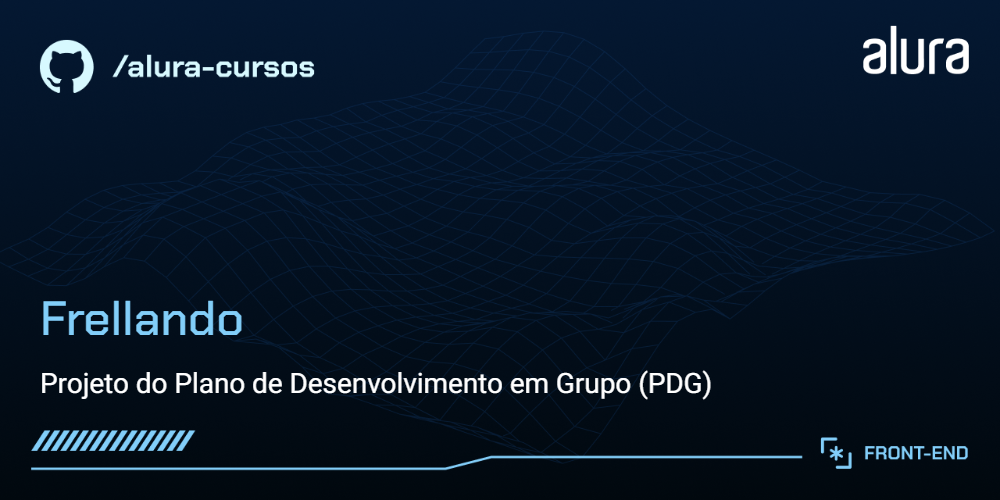

# Freelando

O Freelando é uma StartUP.
Nesse momento, é um MVP que tá só começando e ainda tem muitas funcionalidades novas para serem desenvolvidas.

## 🔨 Funcionalidades do projeto

Nesse primeiro momento, nós temos a página que foi idealizada como a primeiro entrega do time de desenvolvimento.

O [Figma dessa aplicação você encontra aqui](https://www.figma.com/file/DGIzbfXEi27oiKzI0nGMIV/Freelando-%7C-WebApp-com-React?node-id=244%3A11524&t=J2NfqHrvVIr0jsgs-0).

## ✔️ Técnicas e tecnologias utilizadas

Se liga nessa lista de tudo que usaremos nesse curso:

- `React`
- `Create React App`
- `Emotion`
- `React Grid System`
- `Eventos do Teclado`
- `GitHub`
- `Trello`
- `Figma`

E muito mais!

## 🛠️ Abrir e rodar o projeto

Para abrir e rodar o projeto, execute `npm i` para instalar as dependências e `npm start` para inicar o projeto.

Depois, acesse <a href="http://localhost:3000/">http://localhost:3000/</a> no seu navegador.

## ⚙️ Contribuindo

1. Crie um fork!
2. Crie sua feature branch: `git checkout -b my-new-feature`
3. Adicione os arquivos modificados: `git add .`
4. Faça um Commit com suas alterações: `git commit -m "Add some feature"`
5. Faça um push da sua branch: `git push origin my-new-feature`
6. Envie um Pull Request para esse repositório
7. Adicione um título e uma descrição que deixe claro sua sugestão :)

**Depois que seu pull request for mergeado**

> Depois que seu pull request for mergeado, você pode apagar sua branch.

## 📚 Mais informações

O Freelando é uma StartUP fictícia utilizada nesse curso da Alura.
A ideia principal desse curso é evoluir ainda mais os conhecimentos em React e estilização de componentes.
